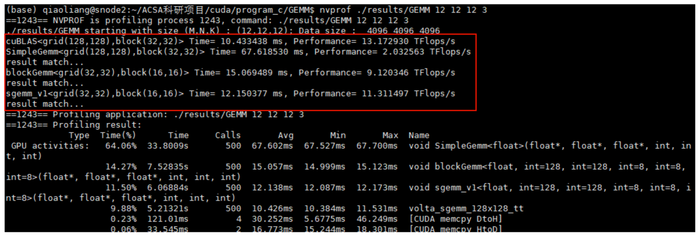

# Single GEMM
CPU ——> GPU(global memory) ——> block shared memory ——> block register memory

# performance
| Key | Value |
| ------ | ------- |
| Exp Environment | NVIDIA TITAN V|
| Global memory | 12066MB|
| Matrix Size |   $2^{12} \times 2^{12}$|
| FP32 Peak flops | 14.9T|
| CUDA CORE | 5120 |

